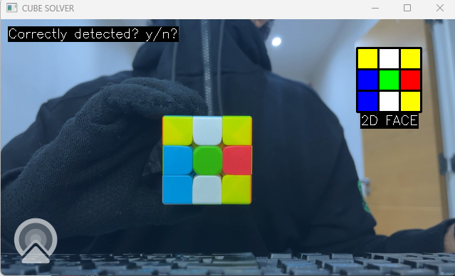
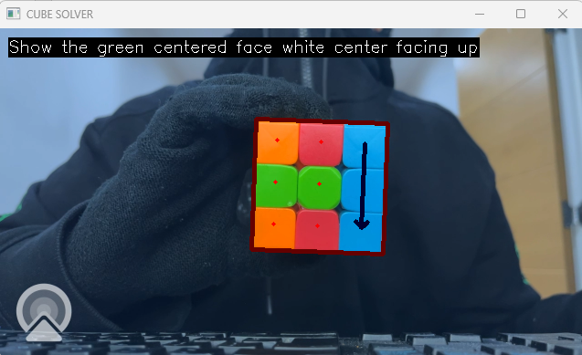
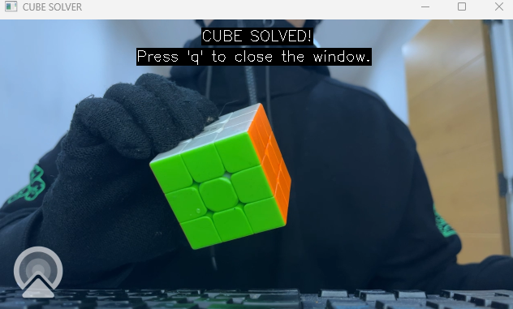

# Rubik's Cube Solver using OpenCV

## About the Project

This is a real-time Rubik’s Cube solver built with OpenCV:

- **Detects** a cube face from a webcam feed and locates the 3×3 grid of facelets.
- **Classifies colors** on each face (HSV-based in this version) and reconstructs the full cube state.
- **Solves** the cube using the Kociemba two-phase algorithm.
- **Guides the user** with an augmented overlay (arrows/2D net) so anyone can follow the moves without knowing notation.


## Computer Vision & Geometry Used

**1) Face proposal (square detection)**
- Convert to HSV and threshold a broad “bright card” range to isolate the cube face background.
- Extract **contours** and fit a minAreaRect to get a rotated bounding box.
- Filter by **area**, **aspect ratio**, **rotation angle**, and **rectangle-likeness** (point-in-polygon margin test).
- Compute a stable, image-space **3×3 grid of facelet centers** from the box geometry.

**2) Color segmentation (per frame)**
- Convert full frame to HSV.
- Build binary **masks** for each color using predefined HSV ranges (see config.py).
- Find contours in each color mask and associate them to the nearest **predicted facelet centers**.
- Use **relative area heuristics** and **parent/child contour checks** to avoid picking borders/highlights.

**3) Face verification & state assembly**
- For each face: interactive verification (y/n) to lock a clean read.
- Save face colors into a 3×3 grid per face; mirror where needed for screen alignment.
- Concatenate the six faces into the 54-character **Kociemba string** in the expected order.

**4) Solving & AR guidance**
- Run kociemba.solve(state) to obtain a move sequence.
- Draw **on-screen arrows** (U/D/L/R/F/B and whole-cube x/y turns) aligned with the detected facelet grid.
- Show a synchronized **2D net** of the cube so users see progress after each move.

**Design choices & trade-offs**
- HSV thresholds are **fast and transparent**, and work well under neutral lighting.
- Geometric gating (area/angle/rectangularity) reduces false positives but can be strict at extreme tilts.
- Verification keeps the live loop robust without adding heavy ML.
- Future work: homography rectification before sampling, per-session color **calibration/centroids**, periodicity (“gridness”) scoring, and optional ArUco fallback for harsh lighting.


## Project Structure
The project has been refactored into a modular package structure for better maintainability:

```
rubiks_cv/
├── __init__.py          # Package initialization
├── config.py            # Constants and HSV color ranges
├── cube.py              # Cube class and rotation logic
├── utils.py             # Utility functions
├── vision.py            # Computer vision functions
├── ui.py                # UI and drawing functions
├── solver.py            # Solving logic and orchestration
└── main.py              # Entry point
```

## How the Cube-Solver works
1) The application first prompts the user to show a certain colour-centred face to the camera where the colours of each of the smaller facelets that make up the face are recorded. This is done using a range of masks that filter out a specific colour that is within a predefined set of HSV values.
  
2) Once the user has correctly shown all 6 faces of the cube to the webcam, the state of the cube has been recorded and with the help of the kociemba library the moves required to solve the scrambled cube are calculated.
3) These moves are then displayed on the cube one by one and once the user has followed all the displayed instructions the Rubik's cube would have been solved.

<!-- Vertical pipeline with titles on top -->
<div style="text-align: center; margin: 20px 0;">

   <div style="margin-bottom: 30px;">
     <h3 style="margin-bottom: 10px;">1) Detect faces</h3>
     
   </div>

   <div style="margin-bottom: 30px;">
     <h3 style="margin-bottom: 10px;">2) Apply Moves</h3>
     
   </div>

   <div style="margin-bottom: 30px;">
     <h3 style="margin-bottom: 10px;">3) Solved Cube</h3>
     
   </div>

</div>

## Demo

The demo PDF contains a comprehensive demonstration of the full solving pipeline, showcasing each step of the cube detection and solving process from start to finish.

📄 **[View Demo PDF](assets/Demo.pdf)**

## Getting Started

### Prerequisites
- Python 3.10 or higher
- Webcam/camera access
- A Rubik's cube

### Installation
1) Clone or download this repository
2) Install the required dependencies:

```bash
pip install -r requirements.txt
```

Or install manually:
```bash
pip install opencv-python numpy kociemba
```

### Running the Application

```bash
python -m rubiks_cv.main
```


### Usage Instructions

1. **Launch the application** - The camera window will open
2. **Detection Phase**:
   - Follow the on-screen instructions to show each face of the cube
   - The program will ask you to show faces in this order: white, yellow, blue, red, green, orange
   - Position the cube so the specified center color is facing the camera
   - Press 'y' to confirm detection or 'n' to restart
3. **Solving Phase**:
   - Follow the visual arrows displayed on the cube
   - Execute each move as shown
   - Continue until the cube is solved

### Controls
- **'q'** - Quit the program
- **'y'** - Confirm face detection
- **'n'** - Restart face detection

## Important Note: HSV Color Ranges

⚠️ **The HSV color ranges in `rubiks_cv/config.py` are calibrated for specific lighting conditions and cube colors. You may need to adjust these ranges for your environment.**

The current HSV ranges are:
```python
colour_ranges = {
    "blue": (np.array([70, 100, 220]), np.array([120, 255, 255])),
    "red": (np.array([110, 120, 150]), np.array([180, 255, 255])),
    "green": (np.array([45, 130, 60]), np.array([70, 255, 255])),
    "orange": (np.array([0, 175, 150]), np.array([25, 255, 255])),
    "yellow": (np.array([20, 130, 60]), np.array([50, 255, 255])),
    "white": (np.array([0, 0, 0]), np.array([180, 80, 255])),
}
```

**Future Improvement**: Automatic HSV range calibration is a planned feature to make the solver work reliably across different lighting conditions and cube types.

## Troubleshooting

- **Camera not working**: Ensure your webcam is not being used by another application
- **Poor color detection**: Adjust the HSV ranges in `config.py` for your lighting conditions

